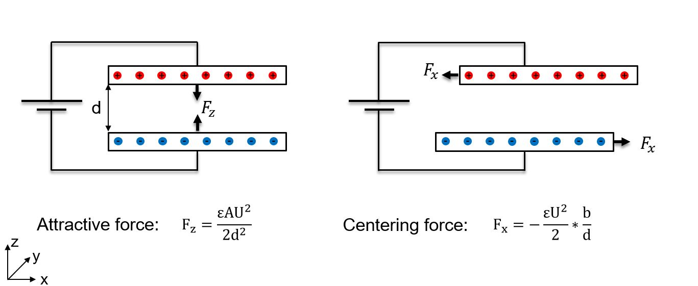
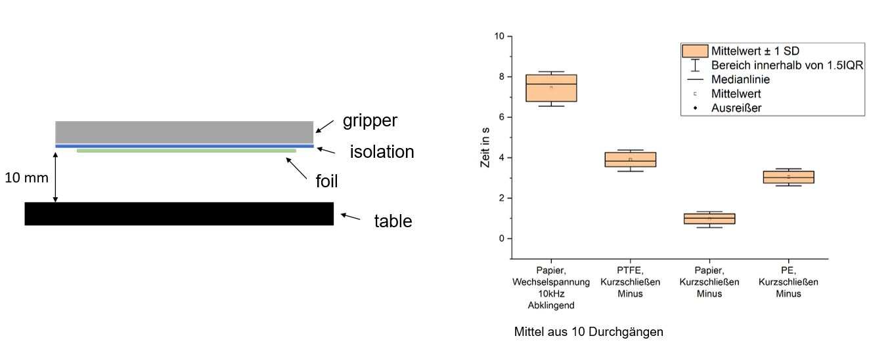

# Elektrostatischer Greifer

Dieses Projekt ist im Zuge meines Studiums entstanden. Ziel war es, einen Greifer zur Handhabung von dünnen (<20um) Lithiumfolie zu entwickeln. Problematisch bei Lithium ist, dass das Material sehr reaktiv und empfindlich ist. Die Handhabung findet daher meistens in einer Schutzgasatmosphäre wie Argon statt.Pneumatischen Greifer, wie Flächensauggreifer, die gerne in der Folienhandhabung genutzt werden, sind daher problematisch, da als Prozessmedium ebenfalls das Schutzgas genutzt werden müsste. Zudem besteht beim Einsatz von Pneumatik die Gefahr der Kontamination der Folie mit Patikeln aus der Umgebung. Eine Lösung sind daher Elektrostatische Greifer.

Bei Interesse kann ich dir meine komplette Ausarbeitung zukommen lassen.

## Funktionsprinzip

Basis ist der Effekt, das sich unterschiedliche elektrische Ladungen anziehen. Legt man eine Spannung an zwei parallel zu einander ausgerichteten Platten an, entsteht eine anziehende Karft zwischen beiden Platten (vgl. Kräfte bei einem Plattenkondensator). Ebenso ensteht eine zentrierende Krft, wenn beide Platten zueinander verschoben werden.

## Greiferdesigns

Auf Basis dessen lassen sich unterschiedliche Greiferdesigns entwickeln. Das einfachste Design (Monopolar) bleibt bei dem Prinzip der beiden parallen Platten, wobei eine Platte durch den Greifer gebildet wird und die zweite durch die zuhandhabende Folie. Die Spannung wird zwischen Greifer und Folie angelegt. 

Bei dem Bipolar Aufbau besteht der Greifer aus zwei Elektroden, zwischen den eine Spannung angelegt wird. Dies hat zur Folge, das sich in der elektrisch leitenden Folie die Elektroden verschieben (Influenz). Der Geifer bildet zusammen mit der Folie zwei in Reihe geschaltete Kondensatoren. Dieses Design hat den Vorteil, das die Folie nicht elektrisch Kontaktiert bzw. geladen werden muss. Allerdings halbiert sich hierbei die maximal erreichbare Kraft, da sich die angelegt Spannung auf die beiden Kondensatoren aufteilt. 

Auf Basis des Bipolar Designs können auch nicht leitende Materialien wie Papier gehandhabt werden. Dabei sorgt nicht Influenz für eine Ladungsverschiebung sondern Polarisation. Die einzelnen Moleküle innerhalb des Materials richten sich nach dem durch den Greifer erzeugten Elektrostatischen Feldes aus (Dipol Bildung). Die so erreichbare Kraft ist niedrieger als bei leitenden Materialien. Wichtig ist vor allem ein starkes Elektrisches Feld, weshalb hier ein Interdigitaldesign zu beforzugen ist. Der geringere Abstand zwischen den gegenpoligen Elektroden sorgt für eine höhere elektrische Feldstärke.

## Greifer

Der Greifer besteht aus zwei Kupferelektroden mit einer Fläche von jeweils 70 x 35mm. Der Isolationsabstand zwischen den beiden Flächen beträgt 1 bis 2 mm. Zwischen den beiden Elektroden liegt eine Spannung von 1000 V an.
|  |   |
|--|---|
| | |
|nackter Greifer/ Platine |Greifer mit Gehäuse und Isolierung |

 
Damit die elektrisch leitfähige Lithiumfolie bei der Handhabung die beiden Elektroden nicht kurzschließt, müssen diese isoliert werden. Problematisch dabei ist, dass das Isolationsmaterial dem elektrischen Feld ausgetzte ist, dadurch polarisiert wird und ebenfalls ein elektrisches Feld erzeugt. Wird nun der Greifer abgeschaltet, klingt die Polarisation des Isolationsmaterial nur langsam ab und das dadurch erzeugte Feld hält weiterhin die Folie am Greifer. Das Isolationsmaterial muss daher schlecht polarsierbar sein, um ein schnelles Abschalten des Greifers bzw. Ablegen der Folie erreichen zu können. Als Kennziffer für die Polarisationsfähigkeit kann die [Permittivität](https://de.wikipedia.org/wiki/Permittivit%C3%A4t) genutzt werden. Je kleiner die Zahl, desto schlechter die Polarisierbarkeit.

Auf Basis dessen wurden verschiedene Materialien getestet. Zusätzlich wurden verschiedene Abschaltstrategien untersucht. Neben dem Trennen der beiden Elektroden von der Spannungsversorgung wurden die beiden Elektroden zum Abschalten auf Minus bzw. Plua geschaltet. Als am Geeignetsten  hat sich leicht angerautes Papaier herausgestellt zusammen mit dem Kurzschließen der beiden Elektroden über den Minuspol der Spannungsversorgung. So konnte eine Abschaltzeit von unter einer Sekunde erreicht werden.

*release times with different isolation materials and turn off methods*

## Praxis

Bei einer Elektrodenfläche von insgesamt 70 x 70 mm konnte eine maximale Kraft von 0,35 N erreicht werden, dies entspricht ca 35 Gramm.

Der praktische Einsatz funktionert ebenfalls:

**Video:**

Interdigitaldesign für z.B. Papier: 

 

  