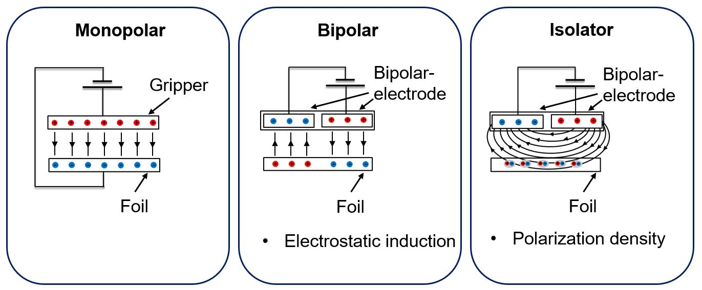
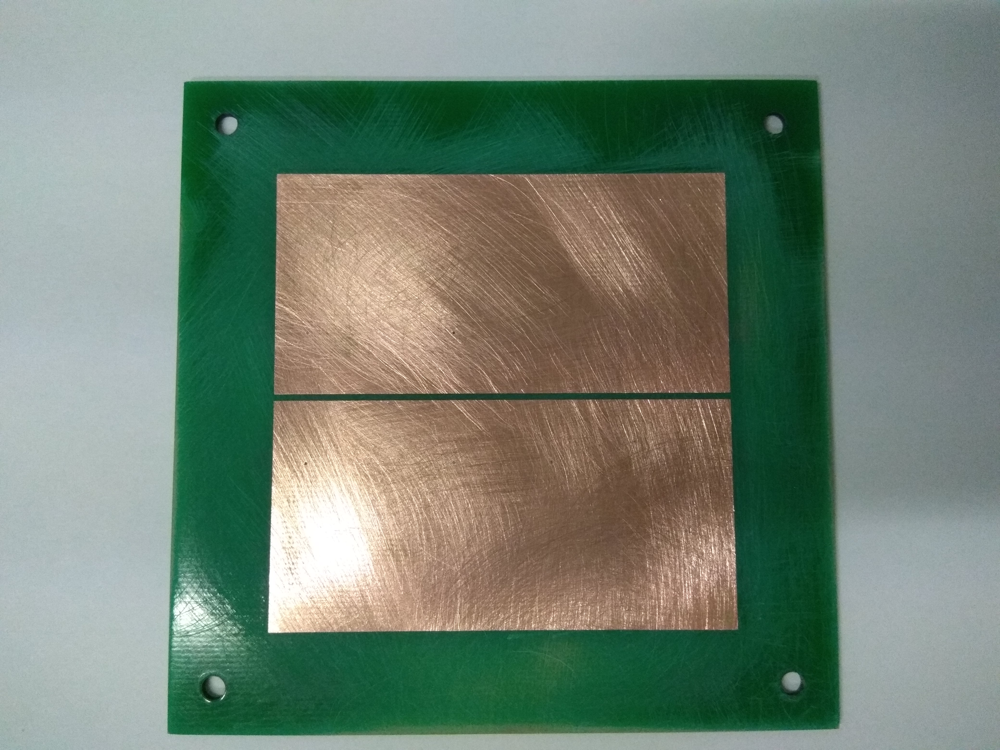
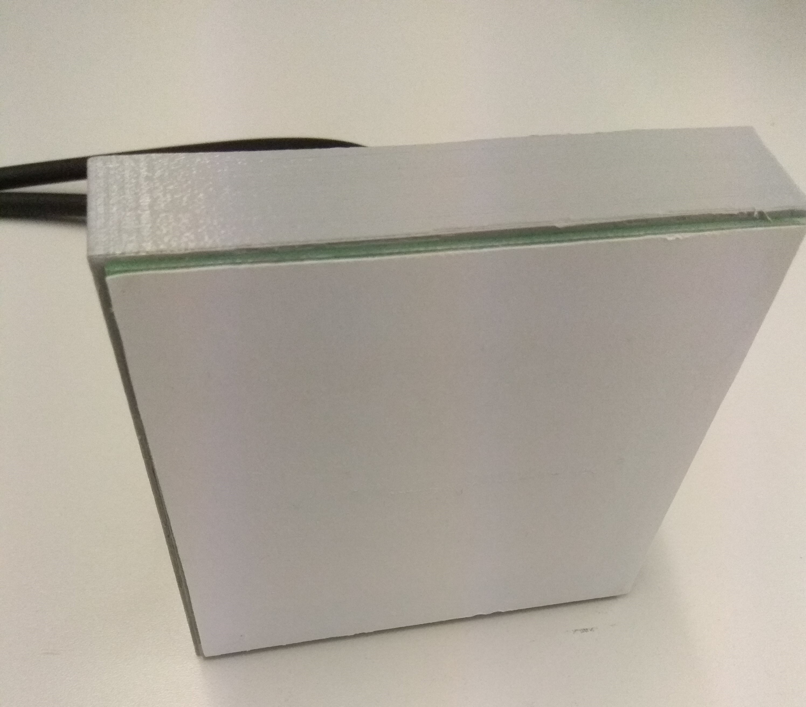
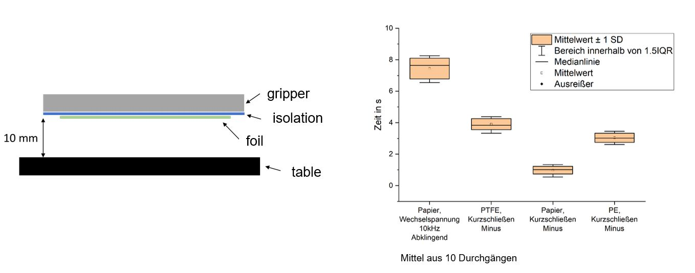
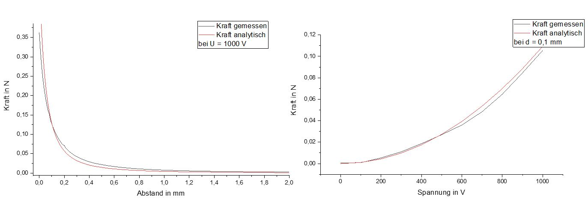
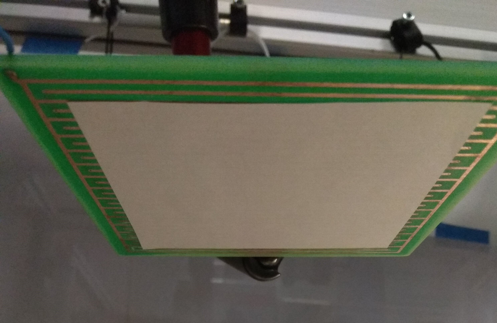

# Electrostatic gripper

This project was developed in the course of my studies. The goal was to develop a gripper for handling thin (<20um) lithium foil. The problem with lithium is that the material is very reactive and sensitive. Pneumatic grippers, such as large-area suction pads, which are often used in film handling, are therefore problematic because the inert gas would also have to be used as the process medium. In addition, when using pneumatics, there is a risk of contaminating the film with paticles from the environment. Electrostatic grippers are therefore a solution.

If you are interested, I can send you my complete thesis.

## Functional principle

The basis is the effect that different electrical charges attract each other. If a voltage is applied to two plates aligned parallel to each other, an attractive force is created between the two plates (compare forces in a plate capacitor). Likewise, a centering force is created when the two plates are moved relative to each other.

## Gripper designs

Based on this, different gripper designs can be developed. The simplest design (monopolar) sticks to the principle of two parallel plates, where one plate is formed by the gripper and the second by the foil to be handled. The voltage is applied between the gripper and the foil. 

In the bipolar design, the gripper consists of two electrodes between which a voltage is applied. This causes the electrodes in the electrically conductive foil to move (induction). The gripper together with the foil forms two capacitors connected in series. This design has the advantage that the foil does not have to be electrically contacted or charged. However, the maximum achievable force is halved, since the applied voltage is divided between the two capacitors. 

Based on the bipolar design, non-conductive materials such as paper can also be handled. In this case, it is not influence that causes a charge shift, but polarization. The individual molecules within the material align themselves with the electrostatic field generated by the gripper (dipole formation). The force that can be achieved in this way is lower than with conductive materials. A strong electric field is particularly important, which is why an interdigitated design is preferable here. The smaller distance between the opposing electrodes ensures a higher electric field strength.

## Gripper design

The gripper consists of two copper electrodes, each with an area of 70 x 35mm. The insulation distance between the two surfaces is 1 to 2 mm. A voltage of 1000 V is applied between the two electrodes.
| | |
|--|---|
| | |
|naked gripper/board |gripper with housing and insulation |

 
To prevent the electrically conductive lithium foil from short-circuiting the two electrodes during handling, they must be insulated. The problem here is that the insulation material is exposed to the electric field, is thereby polarized and also generates an electric field. If the gripper is now switched off, the polarization of the insulation material subsides only slowly and the field thus generated continues to hold the film to the gripper. The insulation material must therefore be poorly polarizable in order to be able to switch off the gripper or deposit the film quickly. The [permittivity](https://de.wikipedia.org/wiki/Permittivit%C3%A4t) can be used as an index for the polarization capability. The smaller the number, the worse the polarizability.

Based on this, different materials were tested. In addition, different disconnection strategies were investigated. In addition to disconnecting the two electrodes from the power supply, the two electrodes were switched to negative or plua for shutdown. Lightly roughened paper was found to be the most suitable, together with short-circuiting the two electrodes via the negative terminal of the power supply. This way a switch-off time of less than one second could be achieved.

*release times with different isolation materials and turn off methods*

## Practice

With an electrode area of 70 x 70 mm in total, a maximum force of 0.35 N could be achieved, which corresponds to approx. 35 grams.

The practical application also works:

**Video:**

Interdigitaldesign for e.g. paper: 

